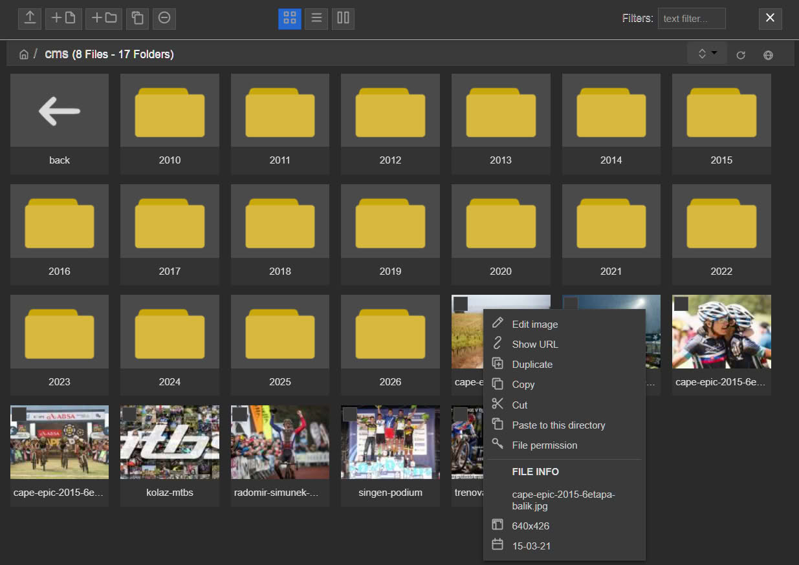

# Responsive FileManager for TinyMCE 8 and PHP 8.x

**Modernized by [Radek Hulán](https://mywebdesign.dev/)**

This is a modernized fork of [ResponsiveFilemanager](https://github.com/trippo/ResponsiveFilemanager) by Alberto Peripolli (tr1pp0).

## What's New in This Fork

- **PHP 8.5 Support** - Updated codebase to be fully compatible with PHP 8.5
- **TinyMCE 8 Integration** - Native support for TinyMCE version 8.x
- **WebP Support** - Full support for WebP image format — upload, preview, thumbnails, and TUI editing all work with `.webp` files out of the box
- **Updated JS Libraries** - All JavaScript dependencies updated to their latest versions
- **Local JS Libraries** - Switched from CDN links to local copies (many CDNs no longer exist or are unreliable)
- **Optional Dark Mode** - Added a dark mode theme that can be enabled via configuration
- **SVG Icons** - Replaced legacy raster (PNG) icons with clean, scalable SVG icons
- **Latest TUI Image Editor** - Bundled the newest version of TUI Image Editor for in-browser image editing
- **Code Cleanup** - General code cleanup, removed deprecated functions and improved code quality

### Dark Mode Example



---

## TinyMCE 8 Integration Example

### Installation

1. Copy the `tinymce/plugins/responsivefilemanager/` folder to your TinyMCE plugins directory
2. Place the `filemanager/` folder somewhere accessible on your web server

Example structure:
```
/your-site/
├── tinymce/
│   ├── tinymce.min.js
│   └── plugins/
│       └── responsivefilemanager/   <- TinyMCE plugin
└── filemanager/                      <- Responsive FileManager PHP files
    ├── config/
    ├── dialog.php
    └── ...
```

### Example Code

```html
<!DOCTYPE html>
<html>
<head>
    <meta charset="utf-8">
    <title>TinyMCE 8 with Responsive FileManager</title>
    <script src="/tinymce/tinymce.min.js"></script>
</head>
<body>
    <textarea id="editor"></textarea>

    <script>
    tinymce.init({
        selector: '#editor',
        license_key: 'gpl',  // Required for TinyMCE 6+ open source

        // Include responsivefilemanager plugin
        plugins: 'image media link responsivefilemanager',
        toolbar: 'undo redo | blocks | bold italic | image media link | responsivefilemanager',

        // Responsive FileManager configuration
        external_filemanager_path: '/filemanager/',  // Path to filemanager/ folder
        filemanager_title: 'File Manager',
        file_picker_types: 'file image media',
        file_picker_callback: function(callback, value, meta) {
            if (window.tinymceRFMFilePicker) {
                window.tinymceRFMFilePicker(callback, value, meta);
            }
        },

        // URL settings
        relative_urls: false
    });
    </script>
</body>
</html>
```

### Configuration Options

| Option | Description |
|--------|-------------|
| `external_filemanager_path` | Path to the filemanager directory |
| `filemanager_title` | Title shown in the file manager dialog |
| `file_picker_types` | Types to enable: `file`, `image`, `media` (space-separated) |


## Configuration (`config.php`)

The main configuration file is located at `filemanager/config/config.php`. Below are the most important settings you should review before deploying.

### Authentication

> [!CAUTION]
> **The file manager does not include built-in user authentication.** By default, anyone who can access the `filemanager/` URL can browse, upload, and delete files. Before deploying to production, you **must** protect access yourself — for example by:
>
> - Adding a PHP session/login check at the top of `config.php` (or in a wrapper)
> - Protecting the `filemanager/` directory with HTTP Basic Auth (`.htpasswd`)
> - Restricting access at the web-server level (IP whitelist, VPN, etc.)
>
> The file manager offers an optional **access key** mechanism (`USE_ACCESS_KEYS`), but this is only a lightweight URL token — it is **not** a replacement for proper authentication.

### Directory & URL Paths

| Variable | Default | Description |
|----------|---------|-------------|
| `upload_dir` | `'/source/'` | URL path (relative to domain root) to the upload folder. Must start and end with `/`. |
| `thumbs_upload_dir` | `'/thumbs/'` | URL path to the thumbnails folder. Must start and end with `/`. |
| `current_path` | `'../source/'` | Filesystem path from the `filemanager/` folder to the upload folder. |
| `thumbs_base_path` | `'../thumbs/'` | Filesystem path from the `filemanager/` folder to the thumbnails folder. Do **not** place inside the upload folder. |

### UI Options

| Variable | Default | Description |
|----------|---------|-------------|
| `tui_active` | `true` | Enable/disable the built-in TUI Image Editor (crop, rotate, filters, etc.). |
| `dark_mode` | `true` | Enable/disable the dark mode theme for the file manager UI. |
| `remove_header` | `false` | When `true`, the file manager renders its own close button so you can hide the TinyMCE dialog header. |

When `remove_header` is enabled, add the following CSS to the page that opens TinyMCE to hide the redundant dialog title bar:

```css
.tox-dialog__header { display: none !important; }
.tox-dialog__body { padding-top: 5px !important; }
```

---

## Original Project

Responsive FileManager is a free open-source file manager made with jQuery, CSS3, PHP and HTML5 that offers a nice and elegant way to upload and insert files, images and videos. It can be used as an external plugin for TinyMCE, CKEditor or as a stand-alone file manager.

Features include automatic thumbnail generation, image resizing, per-folder configuration, multi-user support, and more.

**Original Author:** Alberto Peripolli (tr1pp0) - info@albertoperipolli.com

**Original Repository:** https://github.com/trippo/ResponsiveFilemanager

**Original Documentation:** http://www.responsivefilemanager.com/

Released under Creative Commons Attribution-NonCommercial 3.0 Unported License.

---

### Server Requirements

- **PHP 8.0 or above** (tested up to PHP 8.5)
- [Apache 2.4](https://httpd.apache.org/) or [Nginx](https://nginx.org/)
- GD or ImageMagick extension for image processing

### Localization

- AZE [Elshad Agayev]
- BGR [Stanislav Panev]
- BRA [paulomanrique]
- CAT [Manel Peña]
- CHN [Vu Doan Thang]
- CRO
- CZE [jlusticky]
- DAN [Morten Hesselberg Grove]
- ENG
- ESP [Roberto Santamaria]
- FRA [Mathieu Ducharme]
- GER [Oliver Beta]
- GRC [vkouvelis]
- Hebrew [sagie212]
- HUN [Novak Szabolcs]
- IND [urayogi]
- ITA
- JPN [Vu Doan Thang]
- LTU [Tomas Norkūnas]
- MON [Tumenzul Batjargal]
- NLD [Martijn van der Made]
- NOR [Pål Schroeder]
- Persian [web2web esf ir]
- POL [Michell Hoduń]
- POR [Sérgio Lima]
- RUS [vasromand]
- SLO [Roman Šovčík]
- SVN [Peter Benko]
- SWE [Jon Sten]
- TUR [Ahmed Faruk Bora]
- UKR [Sergey]
- VNM [Chiendv]


### Credits

- [Bootstrap](http://twitter.github.io/bootstrap)
- [Bootstrap Lightbox](http://jbutz.github.io/bootstrap-lightbox)
- [Dropzonejs](http://www.dropzonejs.com)
- [Fancybox](http://fancybox.net)
- [TouchSwipe](http://labs.rampinteractive.co.uk/touchSwipe/demos)
- [PHP Image Magician](http://phpimagemagician.jarrodoberto.com)
- [Mini icons](http://www.fatcow.com/free-icons)
- [Jupload](http://jupload.sourceforge.net)
- [Bootbox](http://bootboxjs.com)
- [jQuery contextMenu](https://swisnl.github.io/jQuery-contextMenu/)
- [Bootstrap-modal](https://github.com/jschr/bootstrap-modal)
- [jPlayer](http://jplayer.org)
- [Lazy Load Plugin for jQuery](http://www.appelsiini.net/projects/lazyload)
